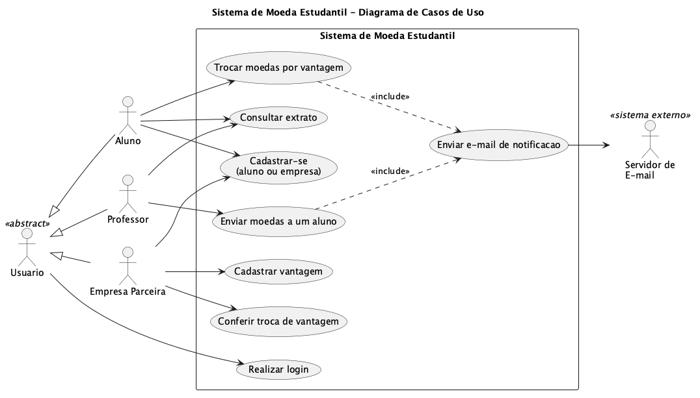
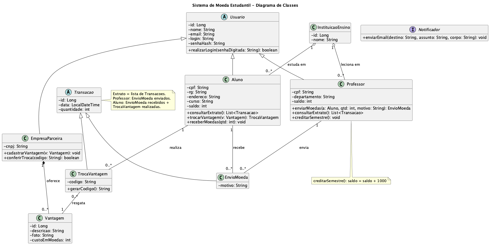
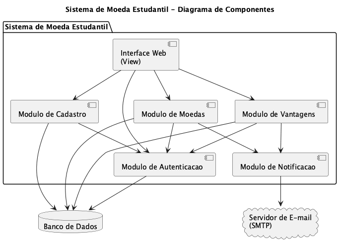
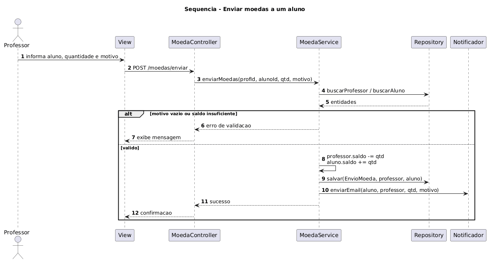
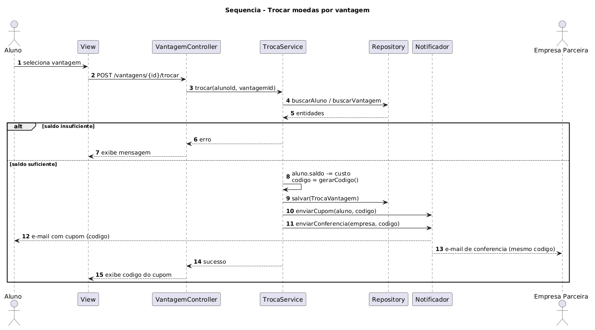

<!-- README baseado no template do Prof. Dr. João Paulo Aramuni (Lab. de Desenvolvimento de Software). Campos em _itálico_ ou entre [colchetes] devem ser preenchidos/adaptados pelo grupo. -->

---

# 🪙 Sistema de Moeda Estudantil 👨‍💻

> [!NOTE]
> Plataforma que estimula o **reconhecimento do mérito estudantil** por meio de uma **moeda virtual**: professores distribuem moedas aos alunos e os alunos as trocam por **vantagens em empresas parceiras**.  

<table>
  <tr>
    <td width="800px">
      <div align="justify">
        O <b>Sistema de Moeda Estudantil</b> conecta <b>professores</b>, <b>alunos</b> e <b>empresas parceiras</b> em um ciclo de reconhecimento: cada professor recebe <b>1.000 moedas por semestre</b> (com saldo acumulável) para premiar bom comportamento e participação em aula; os alunos acumulam essas moedas e as trocam por <b>descontos e produtos</b> cadastrados pelas empresas. Cada troca gera um <b>cupom com código único</b>, enviado por e-mail ao aluno e ao parceiro. Este repositório reúne a <b>modelagem UML</b>, a <b>documentação</b> e o <b>código</b> da <b>Release 1</b>, desenvolvido em <b>arquitetura MVC</b> na disciplina de Laboratório de Desenvolvimento de Software.
      </div>
    </td>
    <td>
      <div>
        
      </div>
    </td>
  </tr> 
</table>

---

## 🚧 Status do Projeto

🟡 **Em desenvolvimento** — Sprint atual: **Lab03S01 (Modelagem)**

### Badges básicos:

[](https://github.com/SEU-USUARIO/sistema-moeda-estudantil/releases)
[](docs/sprints/lab03s01.md)
[](docs/diagramas)
[](#-arquitetura)
[](#-licença)

### Outros badges:

     

> 🔁 Substitua `SEU-USUARIO` pelo usuário/organização do GitHub do grupo. Adicione badges das tecnologias (ex.: Java, React, PostgreSQL) quando a stack for definida.

---

## 📚 Índice
- [Links Úteis](#-links-úteis)
- [Sobre o Projeto](#-sobre-o-projeto)
  - [Perfis de usuário](#perfis-de-usuário)
  - [Regras-chave](#regras-chave)
  - [Roadmap de Sprints](#-roadmap-de-sprints)
- [Funcionalidades Principais](#-funcionalidades-principais)
- [Tecnologias Utilizadas](#-tecnologias-utilizadas)
- [Arquitetura](#-arquitetura)
  - [Diagramas UML](#diagramas-uml)
  - [Mapeamento Componentes × MVC](#mapeamento-componentes--mvc)
- [Instalação e Execução](#-instalação-e-execução)
  - [Pré-requisitos](#pré-requisitos)
  - [Variáveis de Ambiente](#-variáveis-de-ambiente)
     - [1 Back-end](#1-back-end)
     - [2 Front-end](#2-front-end)
     - [3 Exemplos de Variáveis de Ambiente em Provedores de Deploy](#3-exemplos-de-variáveis-de-ambiente-em-provedores-de-deploy)
  - [Instalação de Dependências](#-instalação-de-dependências)
    - [Front-end](#front-end)
    - [Back-end](#back-end)
  - [Inicialização do Banco de Dados](#-inicialização-do-banco-de-dados)
  - [Como Executar a Aplicação](#-como-executar-a-aplicação)
    - [Terminal 1: Back-end](#terminal-1-back-end)
    - [Terminal 2: Front-end](#terminal-2-front-end)
    - [Execução Local Completa com Docker Compose (Incluindo Banco de Dados)](#-execução-local-completa-com-docker-compose-incluindo-banco-de-dados)
    - [Passos para build, inicialização e execução](#-passos-para-build-inicialização-e-execução)
- [Deploy](#-deploy)
- [Estrutura de Pastas](#-estrutura-de-pastas)
- [Demonstração](#-demonstração)
  - [Aplicativo Mobile](#-aplicativo-mobile)
  - [Aplicação Web](#-aplicação-web)
  - [Exemplo de saída no Terminal (para Back-end, API, CLI)](#-exemplo-de-saída-no-terminal-para-back-end-api-cli)
- [Testes](#-testes)
- [Documentações utilizadas](#-documentações-utilizadas)
- [Autores](#-autores)
- [Contribuição](#-contribuição)
- [Agradecimentos](#-agradecimentos)
- [Transparência sobre uso de IA](#-transparência-sobre-uso-de-ia)
- [Licença](#-licença)

---

## 🔗 Links Úteis
* 📦 **Repositório:** [github.com/SEU-USUARIO/sistema-moeda-estudantil](https://github.com/SEU-USUARIO/sistema-moeda-estudantil)
  > 💻 **Descrição:** Repositório oficial do grupo, com todas as versões dos modelos UML e do código.
* 🌐 **Demo Online:** _[link-da-demo-web]_ (a definir, se houver deploy)
  > 💻 **Descrição:** Link para a aplicação em ambiente de produção (Ex: hospedado na Vercel, Netlify ou AWS S3).
* 📱 **Download Mobile:** _Não se aplica na Release 1 (aplicação web)._
  > 📱 **Descrição:** Se o grupo criar um app, inclua aqui os links da App Store, Google Play ou APK direto.
* 📖 **Documentação:** [`docs/`](docs/)
  > 📚 **Descrição:** [Requisitos e regras de negócio](docs/requisitos.md) · [Histórias do Usuário](docs/historias-de-usuario.md) · [Diagramas UML](docs/diagramas/) · [Guia da Sprint Lab03S01](docs/sprints/lab03s01.md)

---

## 📝 Sobre o Projeto

**Por que existe:** valorizar o mérito e o engajamento dos estudantes de forma tangível, criando um mecanismo simples de reconhecimento entre professores e alunos.

**Qual problema resolve:** professores não dispõem de uma forma estruturada e rastreável de reconhecer bom comportamento e participação; alunos não têm retorno concreto por esse esforço. A moeda virtual cria esse elo, e as empresas parceiras ganham visibilidade ao oferecer vantagens.

**Qual o contexto:** projeto acadêmico da disciplina de **Laboratório de Desenvolvimento de Software** (Lab03, Release 1), desenvolvido em três sprints.

**Onde pode ser utilizado:** instituições de ensino participantes (pré-cadastradas), com professores, alunos e empresas parceiras interagindo pela plataforma.

### Perfis de usuário

| Perfil | Como entra no sistema | Principais ações |
|--------|-----------------------|------------------|
| **Aluno** | Auto-cadastro (nome, e-mail, CPF, RG, endereço, instituição e curso) | Receber moedas, consultar extrato, trocar moedas por vantagens |
| **Professor** | Pré-cadastrado a partir da lista enviada pela instituição | Enviar moedas a alunos (com motivo obrigatório), consultar extrato |
| **Empresa Parceira** | Auto-cadastro | Cadastrar vantagens (descrição, foto e custo), conferir trocas pelo código |

### Regras-chave
- Cada professor recebe **1.000 moedas por semestre**; o saldo **acumula** entre semestres.
- O envio exige **saldo suficiente** e **motivo** (mensagem obrigatória).
- O aluno é **notificado por e-mail** ao receber moedas.
- Na troca, o custo é **descontado do saldo** e um **e-mail com o mesmo código** é enviado ao aluno (cupom) e à empresa (conferência).
- Todos os perfis exigem **login e senha** (autenticação obrigatória).

> [!NOTE]
> Regras completas: [`docs/requisitos.md`](docs/requisitos.md)

### 📅 Roadmap de Sprints

| Sprint | Pontos | Entregas | Status |
|--------|--------|----------|--------|
| **Lab03S01** | 6 | Casos de Uso, Histórias do Usuário, Diagrama de Classes, Diagrama de Componentes | 🟡 Em andamento |
| **Lab03S02** | 7 | Modelo ER, estratégia de acesso a dados (ORM/DAO), CRUD inicial de aluno e empresa parceira | ⚪ Pendente |
| **Lab03S03** | 7 | CRUD final, apresentação da arquitetura e persistência, tutorial das tecnologias (~20 min) | ⚪ Pendente |

---

## ✨ Funcionalidades Principais

- 🔐 **Autenticação Segura:** login com senha para aluno, professor e empresa parceira.
- 📝 **Cadastro:** auto-cadastro de alunos (com seleção de instituição pré-cadastrada) e de empresas parceiras.
- 🪙 **Distribuição de Moedas:** professor envia moedas a alunos com motivo obrigatório e validação de saldo.
- 🔄 **Crédito Semestral:** 1.000 moedas por semestre ao professor, com acúmulo do saldo restante.
- 📨 **Notificações por E-mail:** aviso ao aluno ao receber moedas e envio do cupom de troca.
- 📊 **Extrato:** saldo e histórico de transações (envios, recebimentos e trocas).
- 🎁 **Catálogo de Vantagens:** empresas cadastram vantagens com descrição, foto e custo em moedas.
- 🎟️ **Troca com Cupom:** desconto do saldo, geração de código único e conferência pela empresa parceira.

---

## 🛠 Tecnologias Utilizadas

> 🚧 _Stack a ser definida pelo grupo. Preencha conforme as decisões tomadas (a escolha também será apresentada no tutorial da Sprint 03). Recomenda-se listar as versões utilizadas para garantir a compatibilidade._

### 💻 Front-end

* **Framework/Biblioteca:** _[Ex: React v18, Thymeleaf, Angular v17]_
* **Linguagem/Superset:** _[Ex: TypeScript, JavaScript ES6+]_
* **Estilização:** _[Ex: Tailwind CSS, Bootstrap, Material UI]_
* **Gerenciamento de Estado:** _[Ex: Redux Toolkit, Zustand, Context API]_
* **Build Tool:** _[Ex: Vite, Webpack]_

### 🖥️ Back-end

* **Linguagem/Runtime:** _[Ex: Java 17, Node.js 20, Python 3.11]_
* **Framework:** _[Ex: Spring Boot, NestJS, Django]_
* **Banco de Dados:** _[Ex: PostgreSQL, MySQL]_
* **ORM / Query Builder:** _[Ex: Hibernate/JPA, Prisma, TypeORM]_
* **Autenticação:** _[Ex: JWT, Spring Security]_
* **E-mail:** _[Ex: JavaMail, Nodemailer, SendGrid]_

### 📱 Mobile (Opcional)

* **Framework:** _[Ex: React Native, Flutter — não previsto na Release 1]_
* **Ferramentas:** _[Ex: Expo, Android Studio, Xcode]_

### 🧩 Modelagem e Documentação

* **UML:** [PlantUML](https://plantuml.com/) (casos de uso, classes, componentes e sequência)
* **Versionamento:** Git / GitHub

### ⚙️ Infraestrutura & DevOps (opcional)

* **Containerização:** _[Ex: Docker, Docker Compose]_
* **Orquestração:** _[Ex: Kubernetes (K8s)]_
* **Cloud:** _[Ex: AWS, Vercel, Heroku, Google Cloud]_
* **CI/CD:** _[Ex: GitHub Actions, Jenkins, SonarQube]_

---

## 🏗 Arquitetura

O sistema segue o padrão **MVC (Model-View-Controller)**, com uma camada de **Service** para regras de negócio e uma camada de **Repository** (DAO/ORM, definida na Sprint 02) para persistência. Essa separação isola as regras de saldo, cupom e notificação das telas e do acesso a dados, facilitando testes e manutenção.

- **Model:** entidades de domínio (`Usuario`, `Aluno`, `Professor`, `EmpresaParceira`, `InstituicaoEnsino`, `Vantagem`, `Transacao`, `EnvioMoeda`, `TrocaVantagem`).
- **View:** telas de login, cadastro, envio de moedas, extrato, catálogo de vantagens e troca.
- **Controller:** recebe as requisições e orquestra os casos de uso.
- **Service:** regras de saldo, crédito semestral, geração do código do cupom e notificações.
- **Repository:** acesso ao banco de dados.

**Decisões arquiteturais importantes**
- `Transacao` é **abstrata**, com as especializações `EnvioMoeda` (professor → aluno, com motivo) e `TrocaVantagem` (aluno → vantagem, com código), pois têm participantes e regras diferentes.
- `EmpresaParceira` **herda de `Usuario`** para reaproveitar a autenticação.
- O **extrato** é a lista de `Transacao` do usuário.
- O acúmulo semestral é feito por `Professor.creditarSemestre()`, que soma 1.000 ao saldo existente.

### Diagramas UML

Os fontes estão em [`docs/diagramas/`](docs/diagramas/) (`.puml`) e as imagens geradas em `docs/diagramas/img/`.

| Diagrama de Casos de Uso | Diagrama de Classes |
| :---: | :---: |
|  |  |
| [`casos-de-uso.puml`](docs/diagramas/casos-de-uso.puml) | [`diagrama-de-classes.puml`](docs/diagramas/diagrama-de-classes.puml) |
| **Diagrama de Componentes** | **Sequência: Enviar Moedas** |
|  |  |
| [`diagrama-de-componentes.puml`](docs/diagramas/diagrama-de-componentes.puml) | [`sequencia-enviar-moedas.puml`](docs/diagramas/sequencia-enviar-moedas.puml) |
| **Sequência: Trocar Vantagem** | **Modelo ER** |
|  | _Sprint Lab03S02_ |
| [`sequencia-trocar-vantagem.puml`](docs/diagramas/sequencia-trocar-vantagem.puml) | — |

Histórias do Usuário: [`docs/historias-de-usuario.md`](docs/historias-de-usuario.md)

### Mapeamento Componentes × MVC

| Componente (UML) | Responsabilidade | Camadas MVC |
|------------------|------------------|-------------|
| Módulo de Autenticação | Login e validação de senha de todos os perfis | controller + service + model (`Usuario`) |
| Módulo de Cadastro | Cadastro de aluno, empresa e carga de professores | controller + service + model |
| Módulo de Moedas | Envio, extrato, regras de saldo, crédito semestral | controller + service + model (`Transacao`, `EnvioMoeda`) |
| Módulo de Vantagens | Cadastro de vantagens, troca e geração de cupom | controller + service + model (`Vantagem`, `TrocaVantagem`) |
| Módulo de Notificação | Envio de e-mails (moeda recebida e cupom) | service (integração SMTP) |

**Trade-offs / limitações:** _[preencher: ex. saldo armazenado na entidade vs. derivado das transações; e-mails síncronos vs. assíncronos]_

---

## 🔧 Instalação e Execução

> 🚧 _Seção a ser preenchida a partir da Sprint 02, quando houver código executável. Abaixo, o esqueleto do template para adaptar à stack escolhida._

### Pré-requisitos
Certifique-se de que o usuário tenha o ambiente configurado.

* **[Linguagem/Runtime]:** _versão_ (Ex: Java JDK 17+ ou Node.js LTS)
* **Gerenciador de Pacotes / Build:** _[npm, yarn, Maven, Gradle, pip...]_
* **Banco de Dados:** _[PostgreSQL, MySQL...]_
* **Docker** (Opcional, mas **altamente recomendado** para rodar o Banco de Dados)

---

### 🔑 Variáveis de Ambiente

Crie arquivos `.env` específicos e/ou configure as variáveis de ambiente no seu sistema para cada parte da aplicação. **Nunca versione segredos**; mantenha um `.env.example` sem valores sensíveis.

#### 1 Back-end

| Variável | Descrição | Exemplo |
| :--- | :--- | :--- |
| `SERVER_PORT` | Porta do back-end. | `8080` |
| `DB_URL` | URL de conexão com o banco. | `jdbc:postgresql://localhost:5432/moeda_estudantil` |
| `DB_USER` | Usuário do banco. | `postgres` |
| `DB_PASSWORD` | Senha do banco. | `senha-segura-123` |
| `JWT_SECRET` | Segredo para assinatura de tokens (se aplicável). | `chave_super_segura_base64` |
| `MAIL_HOST` | Servidor SMTP para envio de e-mails. | `smtp.gmail.com` |
| `MAIL_PORT` | Porta SMTP. | `587` |
| `MAIL_USER` | Usuário/conta de e-mail remetente. | `noreply@exemplo.com` |
| `MAIL_PASSWORD` | Senha/app password do e-mail. | `sua_senha_aqui` |

#### 2 Front-end

Crie um arquivo **`.env`** na raiz da pasta do front-end. Em projetos **Vite**, use o prefixo `VITE_` (ou `REACT_APP_` se estiver usando CRA) para expor as variáveis ao *bundle* da aplicação.

| Variável | Descrição | Exemplo |
| :--- | :--- | :--- |
| `API_URL` (ou `VITE_API_URL`) | URL base da API consumida pelo front-end. | `http://localhost:8080/api` |

---

#### 3 Exemplos de Variáveis de Ambiente em Provedores de Deploy

> _Opcional. Preencha se o grupo fizer deploy (ex.: Vercel, Railway, Render)._

Nos provedores, as variáveis são configuradas no painel do projeto (ex.: Vercel: Project Settings > Environment Variables).

```
# Back-end
DB_URL=jdbc:postgresql://<host>:5432/moeda_estudantil
DB_USER=<usuario>
DB_PASSWORD=<senha>
MAIL_HOST=smtp.exemplo.com
MAIL_PORT=587
MAIL_USER=<email-remetente>
MAIL_PASSWORD=<senha-ou-app-password>

# Front-end
VITE_API_URL=https://<url-do-backend>/api
```

---

### 📦 Instalação de Dependências

Clone o repositório e instale as dependências.

1. **Clone o repositório:**

```bash
git clone https://github.com/SEU-USUARIO/sistema-moeda-estudantil.git
cd sistema-moeda-estudantil
```

2. **Instale as dependências** _(ajuste à stack escolhida)_:

#### Front-end

```bash
cd frontend
npm install
# ou
yarn install
cd ..
```

#### Back-end

```bash
# Exemplo Maven
cd backend
./mvnw clean install
cd ..

# Exemplo Node.js
# cd backend && npm install
```

---

### 💾 Inicialização do Banco de Dados

_Exemplo com PostgreSQL via Docker:_

1. **Rode o Container do banco de dados:**

```bash
docker run --name moeda_db -e POSTGRES_USER=postgres -e POSTGRES_PASSWORD=senha-segura-123 -e POSTGRES_DB=moeda_estudantil -p 5432:5432 -d postgres:16
```

2. **Execute as Migrações:**  
   _[descrever se o schema é gerado pelo ORM (ex.: Hibernate `ddl-auto`) ou por Flyway/Liquibase/scripts SQL]_

3. **Carga inicial:** as **instituições** e os **professores** são pré-cadastrados; descreva aqui o script/seed que popula esses dados.

---

### ⚡ Como Executar a Aplicação
Execute a aplicação em modo de desenvolvimento em **dois terminais separados** (caso back-end e front-end sejam projetos distintos).

#### Terminal 1: Back-end

```bash
# _[comando de execução do back-end]_
# Ex.: cd backend && ./mvnw spring-boot:run
```
🚀 *O Back-end estará disponível em **http://localhost:8080** (ajuste conforme a stack).*

---

#### Terminal 2: Front-end

```bash
# _[comando de execução do front-end, se separado]_
# Ex.: cd frontend && npm run dev
```
🎨 *O Front-end estará disponível em **http://localhost:5173** (ou a porta configurada).*

---

#### 🐳 Execução Local Completa com Docker Compose (Incluindo Banco de Dados)

> _Opcional. Preencha se o grupo adotar Docker Compose._

Antes de tudo, certifique-se de que o **Docker Desktop** (Mac/Windows) ou o **serviço Docker** (Linux) está em execução.

```bash
sudo systemctl start docker   # Linux
```

---

#### 📦 Passos para build, inicialização e execução

1. Acesse a pasta raiz do projeto (onde está o `docker-compose.yml`):

```bash
cd /caminho/do/projeto/sistema-moeda-estudantil
```

2. Suba todos os serviços definidos no `docker-compose.yml`:

```bash
docker-compose up --build -d
```

> [!NOTE]
> 💡 O parâmetro `--build` garante que as imagens mais recentes do projeto sejam geradas, e `-d` executa em segundo plano.

3. Verifique se os containers estão rodando:

```bash
docker ps
```

4. **Migrações do banco:** confirme nos logs do back-end que o schema foi criado.

```bash
docker logs <nome_do_container_backend>
```

5. Abra no navegador a porta configurada no `docker-compose` (Ex.: <http://localhost:3000> ou <http://localhost:5173>).

6. Para parar e remover os containers e redes:

```bash
docker-compose down
```

---

## 🚀 Deploy

_[Descrever build de produção, variáveis do ambiente e comando de execução, caso o grupo faça deploy.]_

1. **Build do Projeto:**

```bash
# Exemplo genérico
# 1. build do front-end (ex.: npm run build)
# 2. build do back-end (ex.: ./mvnw clean package)
```

2. **Configuração do Ambiente de Produção:** defina as variáveis de ambiente no provedor escolhido (e.g., Vercel, Railway, Heroku, DigitalOcean).

> 🔑 **Variáveis Cruciais:** configure a conexão com o banco de dados (`DB_URL`, `DB_USER`, `DB_PASSWORD`), o servidor de e-mail (`MAIL_*`) e a URL da API de produção para o front-end.

3. **Execução em Produção:**

```bash
# Exemplo genérico: executar o artefato gerado
# java -jar backend/target/nome-do-projeto.jar
```

---

## 📂 Estrutura de Pastas

```
.
├── .gitignore                    # 🧹 Ignora arquivos não versionados (.env, builds, plantuml.jar...).
├── README.md                     # 📘 Documentação principal do projeto.
├── LICENSE                       # ⚖️ Licença do projeto (a adicionar).
│
├── /docs                         # 📚 Documentação e modelagem
│   ├── requisitos.md             # 📋 Regras de negócio, requisitos e premissas.
│   ├── historias-de-usuario.md   # 🧑‍💼 Histórias do Usuário + rastreabilidade com casos de uso.
│   ├── /diagramas                # 🧩 Diagramas UML (PlantUML)
│   │   ├── casos-de-uso.puml
│   │   ├── diagrama-de-classes.puml
│   │   ├── diagrama-de-componentes.puml
│   │   ├── sequencia-enviar-moedas.puml
│   │   ├── sequencia-trocar-vantagem.puml
│   │   ├── README.md             # ℹ️ Como visualizar/gerar os diagramas.
│   │   └── /img                  # 🖼️ Imagens geradas (PNG).
│   └── /sprints
│       └── lab03s01.md           # ✅ Checklist e roteiro de commits da sprint.
│
├── /scripts
│   └── gerar-diagramas.sh        # 🛠️ Gera os PNGs dos diagramas PlantUML.
│
└── /src                          # 💻 Código-fonte (MVC) — a partir da Sprint 02
    ├── /model                    # 🧬 Entidades de domínio.
    ├── /view                     # 🎨 Telas / front-end.
    ├── /controller               # 🎮 Controladores (requisições e casos de uso).
    ├── /service                  # ⚙️ Regras de negócio (saldo, cupom, e-mail).
    └── /repository               # 🗄️ Acesso a dados (DAO/ORM).
```

---

## 🎥 Demonstração

Use GIFs e prints para mostrar o projeto em ação.

> [!WARNING]
> Dê preferência a hospedar suas imagens em um **CDN** (Content Delivery Network) ou no **GitHub Pages** para garantir que elas carreguem rapidamente e não quebrem. Saiba mais sobre o GitHub Pages clicando [aqui](https://github.com/joaopauloaramuni/joaopauloaramuni.github.io).

### 📱 Aplicativo Mobile

_Não se aplica na Release 1 (aplicação web). Se o grupo desenvolver uma versão mobile, adicione aqui GIFs e capturas de tela._

### 🌐 Aplicação Web

Para melhor visualização, as telas principais estão organizadas lado a lado.

| Tela | Captura de Tela |
| :---: | :---: |
| **Login** | **Cadastro de Aluno** |
| _Sua imagem aqui_ | _Sua imagem aqui_ |
| **Cadastro de Empresa Parceira** | **Cadastro de Vantagem** |
| _Sua imagem aqui_ | _Sua imagem aqui_ |
| **Envio de Moedas (Professor)** | **Extrato (Aluno/Professor)** |
| _Sua imagem aqui_ | _Sua imagem aqui_ |
| **Catálogo e Troca de Vantagens** | **Cupom / E-mail de Troca** |
| _Sua imagem aqui_ | _Sua imagem aqui_ |

### 💻 Exemplo de Saída no Terminal (para Back-end, API, CLI)

> _Exemplo ilustrativo. Ajuste rotas e campos à API real do grupo._

#### 1. Demonstração da API (Exemplo com cURL)

```bash
# Professor envia 50 moedas a um aluno
curl -X POST 'http://localhost:8080/api/moedas/enviar' \
     -H 'Authorization: Bearer <jwt-do-professor>' \
     -H 'Content-Type: application/json' \
     -d '{"alunoId": 12, "quantidade": 50, "motivo": "Excelente participação em aula"}'
```

**Saída Esperada:**
```json
{
  "id": 301,
  "tipo": "ENVIO_MOEDA",
  "professorId": 3,
  "alunoId": 12,
  "quantidade": 50,
  "motivo": "Excelente participação em aula",
  "saldoProfessor": 950
}
```

---

## 🧪 Testes

> 🚧 _A preencher a partir da Sprint 02._

### Testes Unitários e de Integração
Para rodar os testes da unidade e integração:

```
# _[comando de testes da stack escolhida]_
```
*Ferramenta utilizada: _[JUnit, Jest, Vitest, PyTest, ...]_*

**Cenários prioritários:** envio com saldo insuficiente, envio sem motivo, crédito semestral acumulando saldo, troca com saldo insuficiente, geração de código único de cupom, autenticação inválida.

### Testes End-to-End (E2E)
Para rodar os testes de ponta a ponta (E2E):

```
# _[comando dos testes E2E, se houver]_
```
*Ferramenta utilizada: _[Cypress, Playwright, Selenium, ...]_*

---

## 🔗 Documentações utilizadas

* 📖 **PlantUML:** [Documentação Oficial](https://plantuml.com/)
* 📖 **UML:** [Guia de Diagramas UML](https://www.uml-diagrams.org/)
* 📖 **Guia de Estilo:** [**Conventional Commits** (Padrão de Mensagens)](https://www.conventionalcommits.org/en/v1.0.0/)
* 📖 **Documentação Interna:** [Requisitos](docs/requisitos.md) · [Histórias do Usuário](docs/historias-de-usuario.md)
* 📖 _[Framework/ORM/banco escolhidos pelo grupo]_

---

## 👥 Autores

**Professor:** _Nome do professor_

| 👤 Nome | 🖼️ Foto | :octocat: GitHub | 💼 LinkedIn | 📤 Gmail |
|---------|----------|-----------------|-------------|-----------|
| Nome 1  | <div align="center"></div> | <div align="center"><a href="https://github.com/user1"></a></div> | <div align="center"><a href="https://www.linkedin.com/in/user1"></a></div> | <div align="center"><a href="mailto:user1@gmail.com"></a></div> |
| Nome 2  | <div align="center"></div> | <div align="center"><a href="https://github.com/user2"></a></div> | <div align="center"><a href="https://www.linkedin.com/in/user2"></a></div> | <div align="center"><a href="mailto:user2@gmail.com"></a></div> |
| Nome 3  | <div align="center"></div> | <div align="center"><a href="https://github.com/user3"></a></div> | <div align="center"><a href="https://www.linkedin.com/in/user3"></a></div> | <div align="center"><a href="mailto:user3@gmail.com"></a></div> |

> [!TIP]
> 💡 **Dica:** Escolha uma foto profissional, preferencialmente de rosto, evitando imagens com baixa qualidade, filtros excessivos ou elementos distrativos.

---

## 🤝 Contribuição
Guia para contribuições ao projeto.

1. Faça um `fork` do projeto.
2. Crie uma branch para sua feature (`git checkout -b feature/minha-feature`).
3. Commit suas mudanças (`git commit -m 'feat: adiciona nova funcionalidade X'`). **(Utilize [Conventional Commits](https://www.conventionalcommits.org/en/v1.0.0/))**
4. Faça o `push` para a branch (`git push origin feature/minha-feature`).
5. Abra um **Pull Request (PR)**.

> [!IMPORTANT]
> 📝 **Regras:** commits pequenos e frequentes, com mensagens claras (ex.: `docs: adiciona diagrama de casos de uso`). Sempre que um modelo UML for alterado, versione o `.puml` **e** a imagem gerada. Veja também o arquivo [`CONTRIBUTING.md`](./CONTRIBUTING.md), se existir.

---

## 🙏 Agradecimentos
Em ambiente acadêmico, citar fontes e inspirações é crucial (integridade acadêmica).

Gostaria de agradecer aos seguintes canais e pessoas que foram fundamentais para o desenvolvimento deste projeto:

* [**Engenharia de Software PUC Minas**](https://www.instagram.com/engsoftwarepucminas/) - Pelo apoio institucional, estrutura acadêmica e fomento à inovação e boas práticas de engenharia.
* [**Prof. Dr. João Paulo Aramuni**](https://github.com/joaopauloaramuni) - Pelos valiosos ensinamentos sobre **Arquitetura de Software** e **Padrões de Projeto**.
* _[Adicione outras pessoas, canais e fontes que ajudaram o grupo.]_

---

## 🤖 Transparência sobre uso de IA

Em conformidade com a política de uso responsável de Inteligência Artificial da disciplina, a estrutura-base deste repositório (rascunhos dos diagramas PlantUML, histórias do usuário e README) foi gerada com apoio da ferramenta **Claude (Anthropic)**.

> ✍️ _O grupo deve descrever aqui o que foi gerado com IA, o que foi revisado/alterado e as decisões próprias tomadas._

---

## 📄 Licença

Este projeto é distribuído sob a **Licença MIT**. _(Adicione o arquivo `LICENSE` ou ajuste esta seção conforme a decisão do grupo.)_

---
